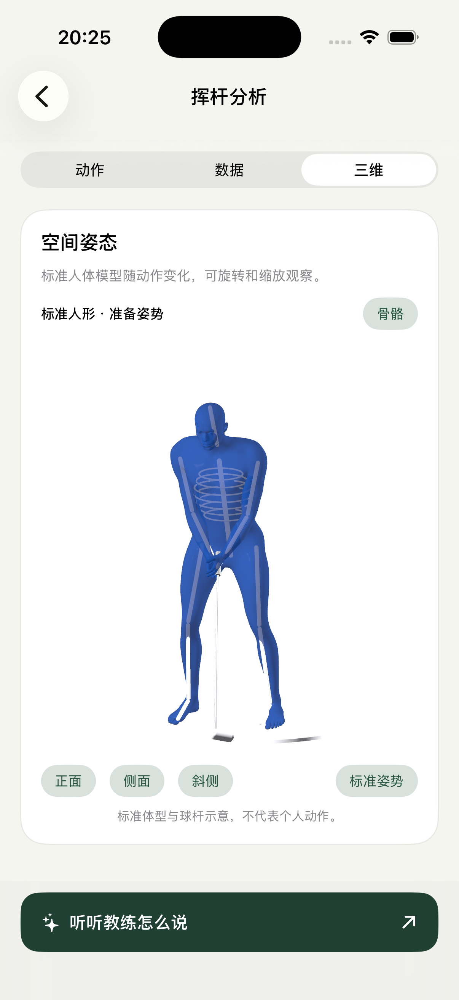

# CoachMe

<p align="center">
  <strong>Turn a golf swing video into reviewable pose data, joint angles, and coach-defined feedback.</strong>
</p>

<p align="center">
  On-device video analysis · MediaPipe pose tracking · Keyframes and angles · Coach-defined rules
</p>

<p align="center">
  <strong>English</strong> · <a href="README.zh-CN.md">Chinese</a>
</p>

<p align="center">
  
  
  
  
  
</p>

## App screenshots

Captured from the running app on the iPhone 17 Pro Simulator. The 3D view shows the standard address pose; the AI page shows a saved conversation, not a validated coaching assessment.

<table>
  <tr>
    <td align="center"><a href="docs/screenshots/home.png"></a></td>
    <td align="center"><a href="docs/screenshots/analysis.png"></a></td>
  </tr>
  <tr>
    <td align="center"><sub>Home · recent swings</sub></td>
    <td align="center"><sub>Video analysis · pose overlay</sub></td>
  </tr>
  <tr>
    <td align="center"><a href="docs/screenshots/avatar.png"></a></td>
    <td align="center"><a href="docs/screenshots/ai-coach.png"></a></td>
  </tr>
  <tr>
    <td align="center"><sub>3D view · standard human model</sub></td>
    <td align="center"><sub>AI coach · follow-up questions</sub></td>
  </tr>
</table>

## Latest functionality

- MediaPipe Heavy by default; local SwingNet detects seven phases, with retry for saved records and manual correction.
- Display-only temporal/body-proportion skeleton completion in 2D and 3D. Estimated segments are dashed and excluded from measurements. A central spine avoids crossed torso diagonals in the 2D projection.
- OpenAI, Claude, Gemini, DeepSeek, and OpenAI-compatible APIs for coaching from original keyframe images, supported by metrics, and follow-up questions. User API keys are stored in the device Keychain.
- 64 core regression tests passed, followed by added authentication/timeout checks; six simulator chat integration tests passed. Real-provider calls require a user API key for verification.

Preview and trim one complete swing before importing; completed analysis opens the workbench. If full-frame phase detection fails, a person crop is attempted. Automatic phase candidates require review. Saved records support retry, manual marks, and reselecting a clip. See [model conversion and upstream terms](tools/swingnet/README.md) and [AI setup/data scope](docs/AI_INTEGRATION.md).

## What works today

- Import real swing footage from Photos and analyze it on the device
- Produce 33 landmarks and world landmarks with MediaPipe
- Detect keyframes and calculate joint- and torso-based metrics
- Smooth landmarks with tuned One Euro presets for real-time and slow-motion footage
- Evaluate coach-entered ranges together with their sources and conditions
- Package results into structured chat context for a future model integration

> [!IMPORTANT]
> CoachMe ships **no built-in “correct” angles**. Outside a range means only
> “outside the range you set,” never “wrong.” When data is insufficient, the app
> says it cannot calculate reliably instead of substituting zero or an estimate.

## Runnable and verified

The current version completes the full analysis path on both the iOS Simulator
and a physical iPhone.

| Check | Result |
|---|---|
| `CoachMeCore` build | ✅ 0 errors, 0 warnings |
| `CoachMeCore` tests | ✅ **46/46** with XCTest |
| iOS app tests | ✅ **24/24** on the iPhone 15 Simulator |
| Real-video pipeline | ✅ decode → pose → keyframes → metrics → rules → chat context |
| MediaPipe inference | ✅ 33 landmarks and world landmarks on real footage |
| Node reference checks | ✅ geometry 31/31, rules 25/25 |
| Physical device | ✅ iPhone 16 Pro / iOS 26.4.2: installed, launched, and completed one analysis |

**Device environment:** Xcode 26.6, iOS 26.5 SDK, and a free Personal Team.
The Simulator build was also verified with Xcode 15.4 and the iOS 17.5 SDK.
MediaPipeTasksVision 0.10.21 is linked.

> [!NOTE]
> Runnable does not mean measurement accuracy has been established. The output
> has not been compared with manual annotation or motion capture, so this project
> publishes no accuracy figure. Device alignment, performance, memory, and battery
> behavior also await systematic evaluation. See [`docs/LIMITATIONS.md`](docs/LIMITATIONS.md).

## Quick start

### Requirements

- macOS with the full Xcode installation
- iOS 17.0 or later
- [XcodeGen](https://github.com/yonaskolb/XcodeGen) and CocoaPods

### Build and run

```bash
tools/download-model.sh          # fetch MediaPipe pose_landmarker_heavy.task
tools/setup-xcode-project.sh     # generate the project, install Pods, fix its format
open CoachMe.xcworkspace         # open the workspace, not the .xcodeproj
```

The generated Xcode project and Google's 29 MB MediaPipe model are deliberately
not committed. The setup scripts prepare both.

### Run on an iPhone

```bash
xcodebuild -downloadPlatform iOS          # once, if the iOS platform is missing
tools/setup-device-signing.sh <TEAM_ID>   # write Team + bundle ID and regenerate
open CoachMe.xcworkspace                  # select the iPhone and press ⌘R
```

Before the first launch, trust the developer certificate under Settings → General
→ VPN & Device Management. A free Personal Team build expires after seven days.
Signing belongs in `project.yml`; a change made only in Xcode's Signing pane is
lost the next time the generated project is rebuilt.

## Tests

```bash
swift test --package-path CoachMeCore

xcodebuild -workspace CoachMe.xcworkspace -scheme CoachMe \
  -destination 'platform=iOS Simulator,name=iPhone 15' test
```

With only the Command Line Tools and no full Xcode installation:

```bash
swift build --package-path CoachMeCore
tools/no-xcode-testrunner/run.sh
node tools/reference/verify_geometry.mjs
node tools/reference/verify_rules.mjs
```

The Node scripts reproduce the Swift formulas and decision order to check the
math independently. They do not replace an app build or runtime test.

<details>
<summary><strong>Repository layout</strong></summary>

```text
CoachMeCore/                 Pure Swift logic; no SwiftUI, AVFoundation, or MediaPipe
  Sources/
    Model/                   Landmarks, frames, swing phases, and keyframes
    Geometry/                Vectors, angles, and the torso coordinate frame
    Metrics/                 Metric catalogue and calculators
    Quality/                 Visibility gates and per-frame quality
    Smoothing/               One Euro filter and pose-sequence smoothing
    Rules/                   Coach rules and the evaluation engine
    Chat/                    Messages, conversations, context, and ChatService
  Tests/                     46 tests

CoachMe/                     iOS app target
CoachMeTests/                24 app tests
tools/reference/             Node geometry and rules reference implementation
tools/no-xcode-testrunner/   XCTest shim for machines without full Xcode
tools/setup-xcode-project.sh Generate the project and install dependencies
tools/setup-device-signing.sh Write physical-device signing configuration
tools/download-model.sh      Download the MediaPipe pose model
docs/                        Metrics, setup, limitations, and AI integration
project.yml                  XcodeGen project specification
```

</details>

## Product principles

1. **Say when a value cannot be computed.** Return the reason; never insert a default angle or estimate.
2. **Do not invent standards for the coach.** Every reference range needs a source and applicable conditions.
3. **Do not pretend AI is connected.** Configured requests call the selected service; unconfigured requests show a status notice. Video stays local.

## Documentation

| Document | Contents |
|---|---|
| [`docs/METRICS.md`](docs/METRICS.md) | Formulas, reference frames, zero points, signs, and caveats |
| [`docs/LIMITATIONS.md`](docs/LIMITATIONS.md) | What is and is not verified; read before trusting a number |
| [`docs/MAC_SETUP.md`](docs/MAC_SETUP.md) | Full Mac, Simulator, and device setup |
| [`docs/AI_INTEGRATION.md`](docs/AI_INTEGRATION.md) | Model input and claims an integration must never make |

## Roadmap

- [x] End-to-end analysis of real swing footage
- [x] MediaPipe pose inference and landmark smoothing
- [x] Coach rule management and evaluation
- [x] Simulator test suite and first physical-device run
- [ ] Measurement-accuracy benchmark
- [ ] Historical analysis comparison
- [ ] Live-camera analysis
- [x] Configurable AI coaching service

## Licence

No open-source licence yet; all rights reserved. The MediaPipe model and test
fixtures carry their own terms. The pose model belongs to Google;
`CoachMeTests/Fixtures/swing3s.mp4` is derived from a
[Pexels clip](https://www.pexels.com/video/38025678/) under the Pexels licence;
and `pose.jpg` comes from Google's MediaPipe sample assets.
