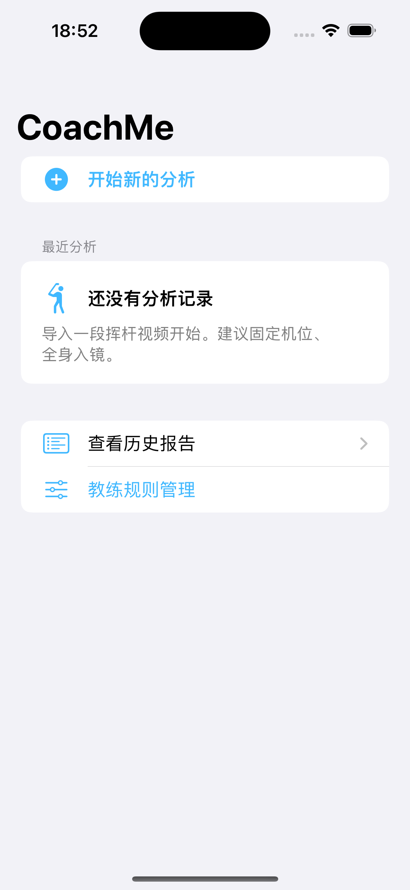

# CoachMe

[English](README.md) · **简体中文**

高尔夫挥杆分析 iOS App。视频 → 骨架 → 角度 → 教练自己录入的参考范围 → 反馈。

CoachMe **不内置任何「正确」角度**。每一条参考范围都由教练自己录入、附带来源，
超出范围时只表述为「超出你设置的范围」，绝不表述为动作错误。



## 当前状态 — 2026-09-10

在 iOS 模拟器上用真实挥杆素材完整跑通。

| 模块 | 状态 |
|---|---|
| `CoachMeCore` 编译 | ✅ 0 error 0 warning |
| `CoachMeCore` 测试 | ✅ **46/46**（真 XCTest） |
| iOS App 构建 | ✅ Xcode 15.4 / iOS 17.5 SDK，MediaPipe pod 已链接 |
| App 测试 | ✅ **24/24**（iPhone 15 模拟器） |
| 真实视频端到端 | ✅ 解码 → 姿态 → 关键帧 → 指标 → 规则判定 → 聊天上下文 |
| MediaPipe 推理 | ✅ 真实素材上产出 33 个关键点 + world landmarks |
| 关键点平滑 | ✅ One Euro，在真实素材上调参，分实时/慢动作两套预设 |
| Node 参考验证 | ✅ 几何 31/31，规则 25/25 |
| **真机运行** | ❌ **受阻**，原因见下 |
| **测量准确度** | ❌ **从未测量**，见 [`docs/LIMITATIONS.md`](docs/LIMITATIONS.md) |
| 历史对比、实时摄像头 | ⬜ 未开始 |

**本项目任何地方都没有准确率数字。** 没有做过任何与人工标注或动作捕捉的对照，
因此无法宣称某个角度读数离真值有多近。哪些验证过、哪些没有，
`docs/LIMITATIONS.md` 里逐条记录。

### 真机为什么受阻

Xcode 15.4 自带的 DeviceSupport 最高到 iOS 16.4，没有 iOS 26 的开发者磁盘镜像，
`devicectl` 报告 `connected (no DDI)`。要往 iOS 26 设备上部署需要 Xcode 26.4，
而它要求 macOS 26.2。所以以下全部在模拟器上运行。

## 结构

```
CoachMeCore/            纯 Swift 逻辑，不依赖 SwiftUI / AVFoundation / MediaPipe
  Sources/
    Model/              关键点、帧、动作阶段、关键帧
    Geometry/           向量、角度、躯干坐标系
    Metrics/            指标定义目录 + 计算器
    Quality/            可见度门槛与帧级质量
    Smoothing/          One Euro 滤波与序列平滑
    Rules/              教练规则与判定引擎
    Chat/               消息、会话、分析上下文、ChatService 接口
  Tests/                46 个测试

CoachMe/                iOS App 目标
tools/reference/        用 Node 复刻同一批公式，无 Swift 工具链时验证算法
tools/no-xcode-testrunner/  只有 Command Line Tools 时跑 XCTest 套件
tools/setup-xcode-project.sh    生成工程 + 装 pod + 修工程格式
tools/setup-device-signing.sh   把签名信息写进 project.yml
tools/download-model.sh         下载 MediaPipe 姿态模型
docs/                   指标定义、Mac 构建、限制说明
project.yml             XcodeGen 描述文件——工程文件是生成的
Podfile                 MediaPipeTasksVision 0.10.21，版本锁定（原因见文件内）
```

## 上手

有两样东西**故意不放进仓库**：生成的 Xcode 工程，以及 5.5 MB 的 MediaPipe 模型
（它适用 Google 自己的许可）。

```bash
tools/download-model.sh          # pose_landmarker_lite.task → CoachMe/Resources/
tools/setup-xcode-project.sh     # xcodegen + pod install + 工程格式修正
open CoachMe.xcworkspace         # 打开 workspace，不是 .xcodeproj
```

`setup-xcode-project.sh` 会把工程格式改写成 `objectVersion = 56`。XcodeGen 2.45
和 CocoaPods 1.16 默认写 `77`（Xcode 16 格式），Xcode 15.4 拒绝打开。
升到 Xcode 16 以后可以删掉这一步。

### 测试

```bash
swift test --package-path CoachMeCore     # 46 个测试，几秒，不需要模拟器
xcodebuild -workspace CoachMe.xcworkspace -scheme CoachMe \
  -destination 'platform=iOS Simulator,name=iPhone 15' test    # 24 个测试
```

### 不装 Xcode

只装了 Command Line Tools 的机器上，`swift test` 会报
`error: XCTest not available`，因为 XCTest 只随完整 Xcode 分发。下面这些照样能跑：

```bash
swift build --package-path CoachMeCore
tools/no-xcode-testrunner/run.sh          # 原封不动的测试文件 + XCTest 垫片
node tools/reference/verify_geometry.mjs  # 31/31
node tools/reference/verify_rules.mjs     # 25/25
```

Node 脚本复刻了 Swift 中的同一批公式与同样的判定顺序，用来确认**算法本身**正确。
它们不能证明 App 能编译或能运行。

## 三条不退让的产品规则

**一、算不出来就说算不出来。** 任何指标在数据不足时显示「无法可靠计算」并给出原因，
绝不用 0、默认角度或推算值填充。这就是为什么 `MetricOutcome` 是一个携带原因的枚举
而不是 `Double?`，为什么 `Vector3.normalized()` 在退化时返回 nil，
以及为什么整条链上没有任何一处会填坑。

**二、不编标准。** App 不内置任何参考范围。教练录入自己的范围，附来源与适用条件。
超出范围时表述为「超出你设置的范围」，绝不表述为错误——`RuleEvaluation` 里
根本没有「动作错误」这个分支。

**三、不假装有 AI。** v1 的 `UnconfiguredChatService` 不发任何网络请求，
只返回「尚未连接」状态，绝不生成教练口吻的文字。

## 文档

| | |
|---|---|
| [`docs/METRICS.md`](docs/METRICS.md) | 每个指标：公式、参考系、零点与方向、告诫 |
| [`docs/LIMITATIONS.md`](docs/LIMITATIONS.md) | 什么验证过、什么没有、为什么。**信任任何数字之前先读这个** |
| [`docs/MAC_SETUP.md`](docs/MAC_SETUP.md) | Mac 上的构建步骤 |
| [`docs/AI_INTEGRATION.md`](docs/AI_INTEGRATION.md) | 模型会收到什么，以及绝不允许它宣称什么 |

## 许可

暂无，保留所有权利。MediaPipe 模型与测试夹具各有自己的条款：姿态模型属于 Google，
`CoachMeTests/Fixtures/swing3s.mp4` 由一段 [Pexels](https://www.pexels.com/video/38025678/)
素材裁切而来、适用 Pexels 许可，`pose.jpg` 来自 Google 的 MediaPipe 示例资源。
