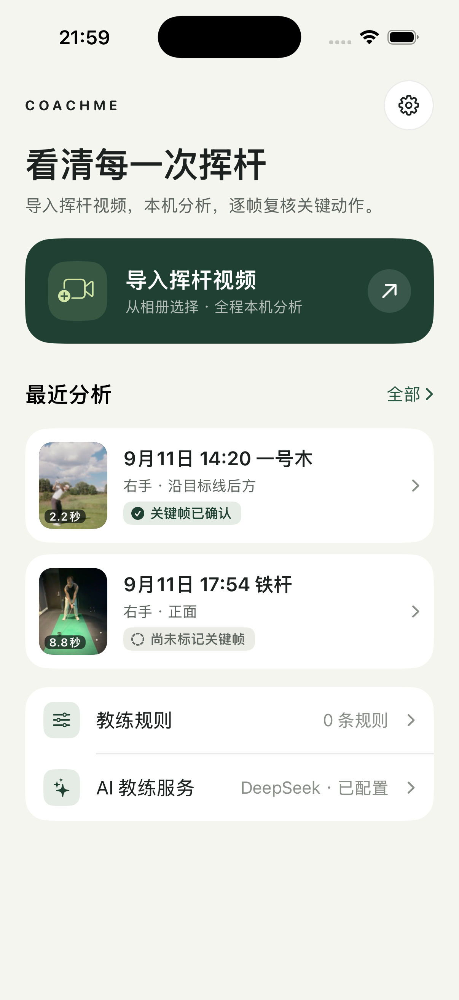
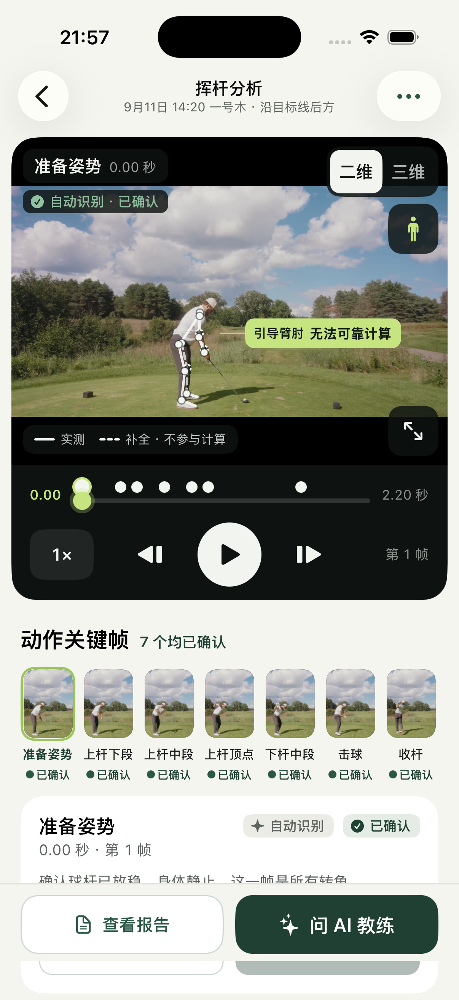
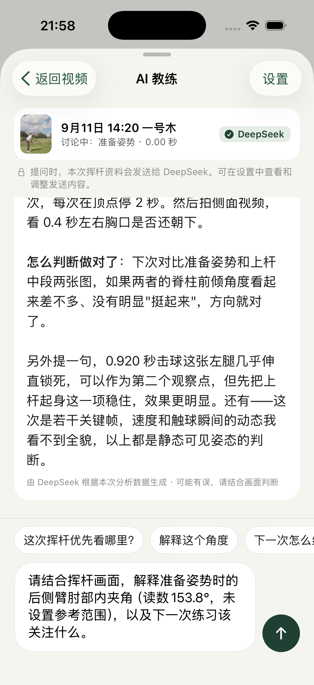

# CoachMe

<p align="center">
  <strong>看清每一次挥杆，让下一次练习更有方向。</strong>
</p>

<p align="center">
  iOS 高尔夫分析工作台 · 七阶段复核 · 二维 / 三维动作查看 · AI 教练
</p>

<p align="center">
  <a href="README.md">English</a> · <strong>简体中文</strong>
</p>

<p align="center">
  
  
  
  
</p>

导入一段挥杆视频，逐帧看清关键动作，再与 AI 教练讨论具体问题。CoachMe 将视频回放、关节角度、阶段复核、分析报告和连续提问放进同一个原生 SwiftUI App。

## 运行截图

新版界面在 iPhone 17 Pro 模拟器中的真实运行截图。AI 页面展示已保存的回复和待发送的具体问题。

<table>
  <tr>
    <td align="center"><a href="docs/screenshots/home.png"></a></td>
    <td align="center"><a href="docs/screenshots/analysis.png"></a></td>
  </tr>
  <tr>
    <td align="center"><sub>首页 · 最近挥杆</sub></td>
    <td align="center"><sub>工作台 · 七阶段复核</sub></td>
  </tr>
  <tr>
    <td align="center"><a href="docs/screenshots/report.png"></a></td>
    <td align="center"><a href="docs/screenshots/ai-coach.png"></a></td>
  </tr>
  <tr>
    <td align="center"><sub>分析报告 · 指标与复核状态</sub></td>
    <td align="center"><sub>AI 教练 · 讨论具体动作</sub></td>
  </tr>
</table>

## 从视频到下一次练习

1. **导入与选段。** 从相册选择视频，保留一次完整挥杆，设置持杆手、球杆、视角和慢动作模式，在设备上查看分析进度。
2. **复核七个阶段。** 准备、上杆下段、上杆中段、顶点、下杆中段、击球、收杆。支持慢放、逐帧前后移动、确认候选帧或用当前画面重新标记。
3. **看清动作变化。** 在二维骨架叠加和可旋转三维人体之间切换，查看两侧肘、膝角度；支持横屏回放，从角度曲线定位回视频。
4. **阅读分析报告。** 按动作阶段查看指标和自定义参考范围，明确哪些关键帧仍待复核。点开指标可查看定义，并直接带着这个问题进入 AI 教练。
5. **继续提问。** 使用 OpenAI、Claude、Gemini、DeepSeek 或 OpenAI 兼容接口，讨论动作重点和练习思路。支持图像输入的模型可结合挥杆画面解读，角度数据辅助判断。

## 功能一览

| 模块 | 当前实现 |
|---|---|
| 界面 | 暖白与森林绿 SwiftUI 界面、统一控件、底部固定报告与 AI 入口 |
| 姿态 | MediaPipe Heavy、33 个关键点、时序平滑与仅用于显示的骨架补全 |
| 关键帧 | 本地 SwingNet 七阶段识别、人物增强重试、手动标记与复核 |
| 三维视图 | 由姿态估计驱动绑定骨骼的人体模型，支持旋转与缩放 |
| 角度曲线 | 区分两侧的角度变化；缺失数据处断开，不跨空白连线 |
| 教练规则 | 自定义范围、来源和适用条件，可单独启用或停用 |
| AI 教练 | 多服务配置、本机钥匙串保存 Key、具体指标提问、新消息自动滚动 |
| 本地记录 | 保存视频、分析结果和历史对话 |

姿态识别、动作阶段识别和角度计算在本机完成。向已配置的 AI 服务提问时，会发送相关分析、对话上下文，以及启用时最多 13 张选定的视频画面；不上传完整视频。详见 [AI 配置与数据范围](docs/AI_INTEGRATION.md)。

## 最近更新

- 首页、导入、工作台、报告、AI 教练、规则与设置统一为新版界面。
- 分析进度可滚动，取消按钮固定在底部；限制缩略图缓存与预览刷新频率。
- 二维显示骨架增加平滑，显示补全与测量数据分开处理。
- 报告显示真实待复核数量，所选阶段、侧别与角度可带入 AI 提问框。
- 待复核阶段保留指标；曲线在缺失或非有限读数处断开。

## 验证记录

2026 年 9 月 11 日验证结果：

| 验证项 | 结果 |
|---|---|
| Core 测试 | 81 项通过 |
| iOS 回归测试 | 33 项通过，1 项真实 API 测试按配置跳过 |
| 界面逻辑定向回归 | 新增报告上下文、具体指标提问、曲线断线用例后，9 项通过；与完整套件有重叠 |
| 构建 | iOS 模拟器与真机版本构建通过 |
| 视频流程 | 8.8 秒视频完成分析，生成 7 个待复核候选帧 |
| 界面走查 | 首页、二维 / 三维、横屏、曲线、报告详情、AI 提问跳转、规则、设置与选段 |
| 手机安装 | 最新版已覆盖安装到 iPhone 16 Pro；自动启动因手机锁屏被系统阻止 |

上述验证针对功能运行，不代表测量或教练建议的准确度已经验证。姿态估计和自动阶段仍需复核，参考范围来自用户设置的教练规则。相关说明见 [测量限制](docs/LIMITATIONS.md)、[SwingNet 来源与许可](tools/swingnet/README.md)、[三维模型归属](CoachMe/Resources/GolfAvatar-LICENSE.txt)。

## 快速开始

### 环境要求

- macOS 与完整 Xcode
- iOS 17.0 或更高版本
- [XcodeGen](https://github.com/yonaskolb/XcodeGen) 与 CocoaPods

### 构建并运行

```bash
tools/download-model.sh          # 下载 MediaPipe pose_landmarker_heavy.task
tools/setup-xcode-project.sh     # 生成工程、安装 Pod、修正工程格式
open CoachMe.xcworkspace         # 打开 workspace，而不是 .xcodeproj
```

仓库不会提交生成的 Xcode 工程，也不会提交 29 MB 的 MediaPipe 模型；脚本会准备好
这两项依赖。

### 在真机上运行

```bash
xcodebuild -downloadPlatform iOS          # Xcode 缺少 iOS 平台组件时运行一次
tools/setup-device-signing.sh <TEAM_ID>   # 写入 Team、bundle ID 并重新生成工程
open CoachMe.xcworkspace                  # 选择 iPhone 后按 ⌘R
```

首次启动前，需要在 iPhone 的「设置 → 通用 → VPN 与设备管理」中信任开发者证书。
免费个人团队签名的 App 会在 7 天后失效。签名配置写在 `project.yml` 中；不要只修改
Xcode Signing 面板，否则重新生成工程时会被覆盖。

## 测试

```bash
swift test --package-path CoachMeCore

xcodebuild -workspace CoachMe.xcworkspace -scheme CoachMe \
  -destination 'platform=iOS Simulator,name=iPhone 17 Pro' test
```

只有 Command Line Tools、没有完整 Xcode 时，可以运行：

```bash
swift build --package-path CoachMeCore
tools/no-xcode-testrunner/run.sh
node tools/reference/verify_geometry.mjs
node tools/reference/verify_rules.mjs
```

Node 脚本复刻 Swift 中的公式和判定顺序，用于独立核对数学逻辑；它们不能替代 App
构建与运行测试。

<details>
<summary><strong>项目结构</strong></summary>

```text
CoachMeCore/                 纯 Swift 逻辑，不依赖 SwiftUI / AVFoundation / MediaPipe
  Sources/
    Model/                   关键点、帧、动作阶段、关键帧
    Geometry/                向量、角度、躯干坐标系
    Metrics/                 指标目录与计算器
    Quality/                 可见度门槛与帧级质量
    Smoothing/               One Euro 滤波与序列平滑
    Rules/                   教练规则与判定引擎
    Chat/                    消息、会话、分析上下文、ChatService 接口
  Tests/                     核心回归测试

CoachMe/                     iOS App 目标
CoachMeTests/                iOS 回归与集成测试
tools/reference/             Node 几何与规则参考实现
tools/no-xcode-testrunner/   无完整 Xcode 时的 XCTest 垫片
tools/setup-xcode-project.sh 生成工程并安装依赖
tools/setup-device-signing.sh 写入真机签名配置
tools/download-model.sh      下载 MediaPipe 姿态模型
docs/                        指标、构建、限制与 AI 接入文档
project.yml                  XcodeGen 工程描述文件
```

</details>

## 文档

| 文档 | 内容 |
|---|---|
| [`docs/METRICS.md`](docs/METRICS.md) | 指标公式、参考系、零点、方向和注意事项 |
| [`docs/LIMITATIONS.md`](docs/LIMITATIONS.md) | 已验证与未验证的内容；信任任何数字前请先阅读 |
| [`docs/MAC_SETUP.md`](docs/MAC_SETUP.md) | Mac、模拟器与真机的完整构建步骤 |
| [`docs/AI_INTEGRATION.md`](docs/AI_INTEGRATION.md) | 模型输入结构及禁止作出的声明 |

## 路线图

- [x] 真实视频端到端分析
- [x] MediaPipe 姿态识别与关键点平滑
- [x] 教练规则管理与结果判定
- [x] iOS 模拟器测试与首次真机运行
- [ ] 测量准确度基准测试
- [ ] 历史分析对比
- [ ] 实时摄像头分析
- [x] 可配置的 AI 教练服务

## 许可

暂无开源许可，保留所有权利。MediaPipe 模型与测试夹具有各自条款：姿态模型属于
Google；`CoachMeTests/Fixtures/swing3s.mp4` 裁切自一段适用 Pexels 许可的
[视频](https://www.pexels.com/video/38025678/)；`pose.jpg` 来自 Google 的 MediaPipe
示例资源。
