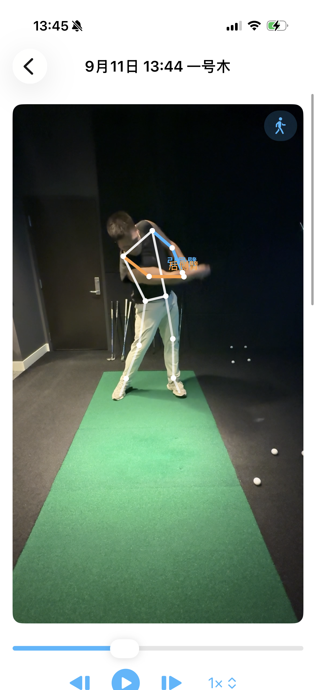

# CoachMe

<p align="center">
  <strong>把一段挥杆视频，变成可复核的姿态、角度与教练反馈。</strong>
</p>

<p align="center">
  本地视频分析 · MediaPipe 姿态识别 · 关键帧与关节角度 · 自定义教练规则
</p>

<p align="center">
  <a href="README.md">English</a> · <strong>简体中文</strong>
</p>

<p align="center">
  
  
  
  
  
</p>

<table>
  <tr>
    <td align="center"></td>
    <td align="center"></td>
  </tr>
  <tr>
    <td align="center"><sub>清晰、直接的分析入口</sub></td>
    <td align="center"><sub>真机视频上的骨架与角度叠加</sub></td>
  </tr>
</table>

## 本次功能更新

- MediaPipe Heavy 默认姿态模型；本地 SwingNet 自动识别六个阶段，支持旧记录重试和人工调整。
- 二维/三维显示骨架按时序与人体比例补全，虚线表示估计；二维躯干使用中央脊柱避免投影交叉。补全不参与指标评分。
- 可配置 OpenAI、Claude、Gemini、DeepSeek 和 OpenAI 兼容 API，支持当前挥杆数据解读与连续问答。密钥存于本机钥匙串。
- 核心回归 64 项通过，后补认证/超时用例通过；聊天模拟器集成 6 项通过。真实 LLM 调用需填入自己的 API Key 后验证。

导入时可预览并选择单次完整挥杆，分析后直接进入工作台。全图识别失败会尝试人物增强；生成的阶段仍需逐帧复核。已有视频可重试、手动调整或重新选段分析。模型来源、转换及许可见 [tools/swingnet](tools/swingnet/README.md)，AI 配置与数据范围见 [接入说明](docs/AI_INTEGRATION.md)。

## 现在可以做什么

- 从相册导入真实挥杆视频，在设备本地完成分析
- 使用 MediaPipe 生成 33 个关键点与 world landmarks
- 自动识别关键帧，计算关节和躯干相关指标
- 使用 One Euro 滤波平滑关键点，并区分实时与慢动作预设
- 由教练录入参考范围、来源和适用条件，再生成规则判定
- 将分析结果整理成结构化上下文，由已配置的大模型解读并支持连续提问

> [!IMPORTANT]
> CoachMe **不内置任何“正确”角度**。超出范围只表示“超出你设置的范围”，
> 不代表动作错误。数据不足时会明确显示“无法可靠计算”，不会用 0 或推算值填充。

## 可运行状态

当前版本已在模拟器和真机完成端到端运行验证。

| 验证项 | 结果 |
|---|---|
| `CoachMeCore` 编译 | ✅ 0 error，0 warning |
| `CoachMeCore` 测试 | ✅ **46/46**（XCTest） |
| iOS App 测试 | ✅ **24/24**（iPhone 15 模拟器） |
| 真实视频分析链路 | ✅ 解码 → 姿态 → 关键帧 → 指标 → 规则判定 → 聊天上下文 |
| MediaPipe 推理 | ✅ 在真实素材上输出 33 个关键点与 world landmarks |
| Node 参考验证 | ✅ 几何 31/31，规则 25/25 |
| 真机运行 | ✅ iPhone 16 Pro / iOS 26.4.2：安装、启动并完成一次分析 |

**真机环境：** Xcode 26.6、iOS 26.5 SDK、免费个人团队签名。模拟器构建也已在
Xcode 15.4 / iOS 17.5 SDK 上验证。MediaPipeTasksVision 0.10.21 已链接。

> [!NOTE]
> “可运行”不等于“测量准确度已验证”。项目尚未与人工标注或动作捕捉系统做对照，
> 因此不提供准确率数字。骨架对齐、性能、内存和电量也尚未完成系统评估。
> 详见 [`docs/LIMITATIONS.md`](docs/LIMITATIONS.md)。

## 快速开始

### 环境要求

- macOS 与完整 Xcode
- iOS 17.0 或更高版本
- [XcodeGen](https://github.com/yonaskolb/XcodeGen) 与 CocoaPods

### 构建并运行

```bash
tools/download-model.sh          # 下载 MediaPipe pose_landmarker_heavy.task
tools/setup-xcode-project.sh     # 生成工程、安装 Pod、修正工程格式
open CoachMe.xcworkspace         # 打开 workspace，而不是 .xcodeproj
```

仓库不会提交生成的 Xcode 工程，也不会提交 29 MB 的 MediaPipe 模型；脚本会准备好
这两项依赖。

### 在真机上运行

```bash
xcodebuild -downloadPlatform iOS          # Xcode 缺少 iOS 平台组件时运行一次
tools/setup-device-signing.sh <TEAM_ID>   # 写入 Team、bundle ID 并重新生成工程
open CoachMe.xcworkspace                  # 选择 iPhone 后按 ⌘R
```

首次启动前，需要在 iPhone 的「设置 → 通用 → VPN 与设备管理」中信任开发者证书。
免费个人团队签名的 App 会在 7 天后失效。签名配置写在 `project.yml` 中；不要只修改
Xcode Signing 面板，否则重新生成工程时会被覆盖。

## 测试

```bash
swift test --package-path CoachMeCore

xcodebuild -workspace CoachMe.xcworkspace -scheme CoachMe \
  -destination 'platform=iOS Simulator,name=iPhone 15' test
```

只有 Command Line Tools、没有完整 Xcode 时，可以运行：

```bash
swift build --package-path CoachMeCore
tools/no-xcode-testrunner/run.sh
node tools/reference/verify_geometry.mjs
node tools/reference/verify_rules.mjs
```

Node 脚本复刻 Swift 中的公式和判定顺序，用于独立核对数学逻辑；它们不能替代 App
构建与运行测试。

<details>
<summary><strong>项目结构</strong></summary>

```text
CoachMeCore/                 纯 Swift 逻辑，不依赖 SwiftUI / AVFoundation / MediaPipe
  Sources/
    Model/                   关键点、帧、动作阶段、关键帧
    Geometry/                向量、角度、躯干坐标系
    Metrics/                 指标目录与计算器
    Quality/                 可见度门槛与帧级质量
    Smoothing/               One Euro 滤波与序列平滑
    Rules/                   教练规则与判定引擎
    Chat/                    消息、会话、分析上下文、ChatService 接口
  Tests/                     46 个测试

CoachMe/                     iOS App 目标
CoachMeTests/                24 个 App 测试
tools/reference/             Node 几何与规则参考实现
tools/no-xcode-testrunner/   无完整 Xcode 时的 XCTest 垫片
tools/setup-xcode-project.sh 生成工程并安装依赖
tools/setup-device-signing.sh 写入真机签名配置
tools/download-model.sh      下载 MediaPipe 姿态模型
docs/                        指标、构建、限制与 AI 接入文档
project.yml                  XcodeGen 工程描述文件
```

</details>

## 产品原则

1. **算不出来就明确说明。** 指标数据不足时返回原因，不使用默认角度或推算值。
2. **不替教练编标准。** 参考范围必须由教练提供，并记录来源与适用条件。
3. **不假装已经接入 AI。** 配置后才调用所选接口；未配置时只显示状态提示，不上传视频。

## 文档

| 文档 | 内容 |
|---|---|
| [`docs/METRICS.md`](docs/METRICS.md) | 指标公式、参考系、零点、方向和注意事项 |
| [`docs/LIMITATIONS.md`](docs/LIMITATIONS.md) | 已验证与未验证的内容；信任任何数字前请先阅读 |
| [`docs/MAC_SETUP.md`](docs/MAC_SETUP.md) | Mac、模拟器与真机的完整构建步骤 |
| [`docs/AI_INTEGRATION.md`](docs/AI_INTEGRATION.md) | 模型输入结构及禁止作出的声明 |

## 路线图

- [x] 真实视频端到端分析
- [x] MediaPipe 姿态识别与关键点平滑
- [x] 教练规则管理与结果判定
- [x] iOS 模拟器测试与首次真机运行
- [ ] 测量准确度基准测试
- [ ] 历史分析对比
- [ ] 实时摄像头分析
- [x] 可配置的 AI 教练服务

## 许可

暂无开源许可，保留所有权利。MediaPipe 模型与测试夹具有各自条款：姿态模型属于
Google；`CoachMeTests/Fixtures/swing3s.mp4` 裁切自一段适用 Pexels 许可的
[视频](https://www.pexels.com/video/38025678/)；`pose.jpg` 来自 Google 的 MediaPipe
示例资源。
